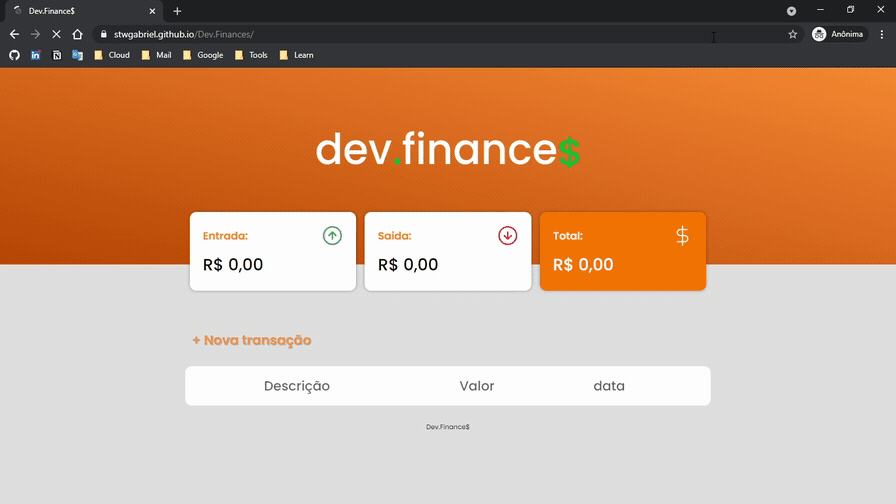

# Dev.Finance$

## Descrição
O Dev Finances é uma aplicaçao de gestao de finanças.

## O projeto

Foi usado HTML e CSS para desenvolver a interface e animações e Javascript para as interações com LocalStorage para salvar os dados no browser.

### linguagens e ferramentas utilizadas

   
   
   
   
